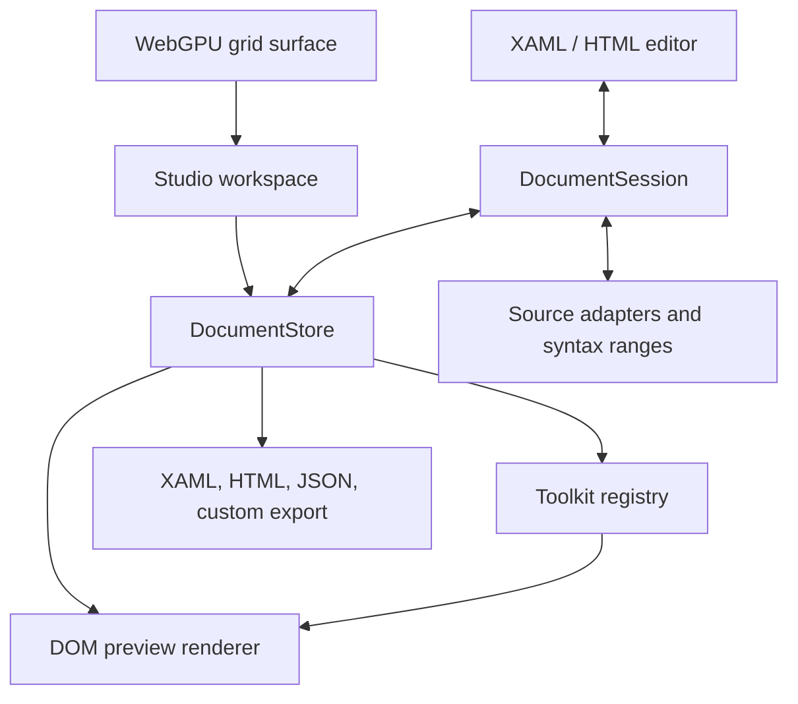
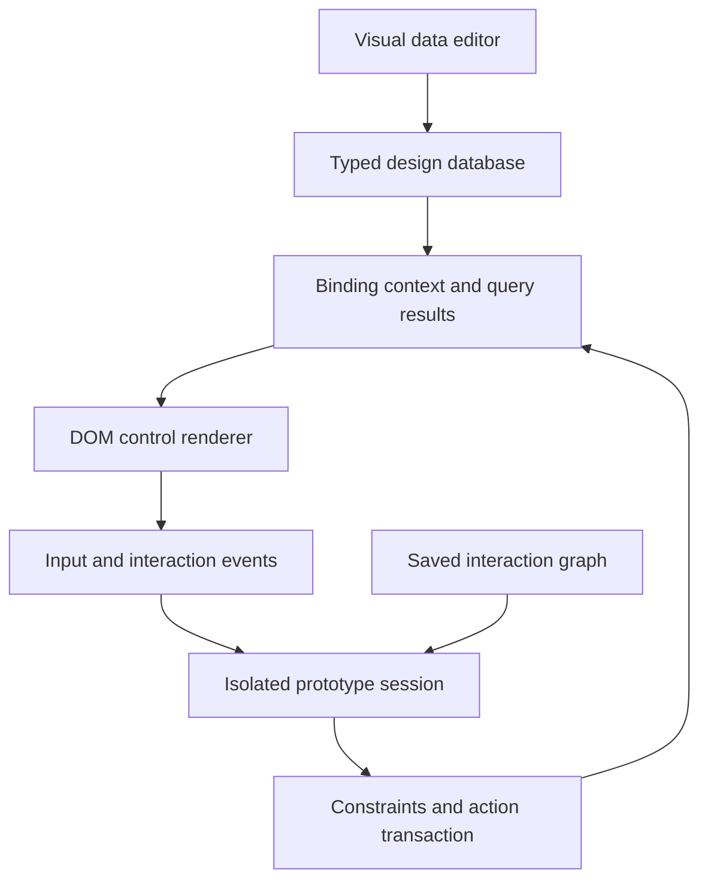

# Xamora Studio — architecture

Version 0.7.0 · 15 September 2026

## 1. Product and engineering scope

Xamora is a browser-based authoring environment for structured UI documents. Its central object model retains authored elements, property elements, attributes, expressions, text, comments, and namespace declarations. The visual representation is an adapter over that model, rather than the authority from which XAML is reconstructed.

This design matters because a runtime object tree is not equivalent to an authored source document. Microsoft documents that `XamlWriter.Save` can dereference resources/bindings and omit information from the original design-time source. Xamora therefore serializes its authoring tree directly. See [Microsoft's serialization limitations](https://learn.microsoft.com/en-us/dotnet/desktop/wpf/advanced/serialization-limitations-of-xamlwriter-save).

The implementation is a usable, modular foundation with explicit compatibility boundaries. Browser layout is not a native WPF/Avalonia measure/arrange engine. Source preservation, metadata support, browser preview, and native runtime validation are separate capabilities.

## 2. Module boundaries



| Module | Responsibility | Host requirements |
| --- | --- | --- |
| `model.js` | Tree identity, traversal, validation, selection, transactions, history | ECMAScript, EventTarget, structuredClone |
| `document-session.js` | Live source/model synchronization, source spans, draft recovery, identity reconciliation, adapter registration | No DOM for XAML; HTML adapter requires DOMParser |
| `xaml.js` | Safe XML-subset parsing, canonical serialization, common-framework mapping, diagnostics | No DOM |
| `registry.js` | Control descriptors, construction, toolkit metadata, export adapters | No DOM for metadata |
| `render.js` | Layout and visual mappings, resources, bindings, templates, standalone HTML | Browser DOM |
| `gpu.js` | Dot-grid rendering, pixel-ratio handling, device-loss fallback | WebGPU when available |
| `editor.js` | Code input, highlighted mirror, validation, completion, find/replace | Browser DOM |
| `design-tools.js` | Logical content parenting, paint/geometry hit testing, drop plans, track edits, identity reconciliation, snapping | Geometry supplied by host; hit service needs DOM |
| `design-data.js` | Typed tables, constraints, indexed queries, safe paths and binding evaluation | No DOM |
| `prototype.js` | Isolated preview state, action transactions, provenance-aware TwoWay writeback | No DOM; EventTarget |
| `xaml-language.js` | Context scanner and source-range completion results | No DOM |
| `studio/canvas-controller.js` | Drag preview/cues, selection cycling, track handles and grid editor | Browser DOM |
| `studio/data-editor.js` | Records, schema, relationships, query builder, objects, import/export | Browser DOM |
| `studio/prototype-editor.js` | Multi-view board, connector editor, interactive session host | Browser DOM |
| `studio/features.js` | Module integration, raw properties, editing helpers, connected example | Browser DOM |
| `app.js` | Base panels, commands, dialogs, local files and persistence | Browser DOM and local storage |

The source modules are native ES modules. No build step or application runtime dependency is required. The local server uses the Node standard library. A static deployment serves the same `dist/` files as local development.

## 3. Universal document model

```ts
interface DesignDocument {
  version: 1;
  id: string;
  name: string;
  framework: string;
  root: ElementNode;
  design: { width: number; height: number };
  annotations: Annotation[];
  metadata: Record<string, unknown>;
  preamble?: TextNode[];
  postamble?: TextNode[];
}

interface ElementNode {
  id: string;
  kind: 'element';
  type: string;
  props: Record<string, string | number | boolean>;
  children: DesignNode[];
  namespaceURI?: string;
  scope?: Record<string, string>;
  source?: { start: number; line: number };
}
```

Elements, property elements, and resource constructs share one tree representation. A `Grid.RowDefinitions` node contains `RowDefinition` elements. A `Button.Template` node contains a `ControlTemplate`. These are retained as source constructs even when a preview adapter cannot evaluate them.

The remaining node kinds are `text`, `comment`, `cdata`, and `pi`. They carry text and an internal ID. The internal ID is not emitted into XAML. XAML names such as `x:Name`, `Name`, and `x:Key` remain authored properties; they are not used as document-tree identity.

Imported namespace scopes are recorded to distinguish prefixed framework controls from similarly named custom controls. Unprefixed built-in names remain convenient for programmatically created documents. Registry identity is currently primarily the authored type string plus an optional namespace-aware fallback for prefixed framework types. A future fully normalized QName registry should key every type by namespace URI and local name, including unprefixed custom namespaces and prefix rebinding after reparenting.

The model can represent non-XAML element documents. An export adapter can translate its tree to HTML, another declarative UI language, a framework schema, or an intermediate representation. This is an extensibility point, not an automatic semantic conversion guarantee between arbitrary UI systems.

## 4. Parse, preserve, and serialize

### Parsing

The parser scans quoted attributes, opening/closing tags, comments, CDATA, processing instructions, and character references. It does not create runtime framework objects or execute markup extensions. Imported `Binding`, `StaticResource`, `DynamicResource`, `TemplateBinding`, event-handler strings, and unfamiliar attributes remain literal authored values.

It validates balanced elements, duplicate attributes, qualified-name structure, declared prefixes, numeric XML character references, invalid control characters, node counts, nesting depth, and model integrity. DTD and entity declarations are rejected. A parse error carries a line and column. Newline offsets are precomputed for source location lookup.

Limits are 2 MB of XAML text, 15,000 nodes, and 150 nested levels. Project-file import has a 15 MB file-size limit. These are practical guardrails, not a complete hostile-input resource isolation boundary.

### Source preservation

Canonical serialization retains ordered elements and properties; resource declaration order is not alphabetized. Attribute ordering groups namespace declarations, class/key/name, attached layout properties, and remaining properties. Short tags remain on one line; longer attribute lists are indented. XML special characters are escaped. Tabs/newlines/carriage returns in attribute values use character references.

Mixed inline text is emitted without inserting structural indentation into the content. `xml:space` inheritance is retained by the parser. Comments, CDATA, and processing instructions are checked before serialization. Explicit empty attribute values are distinct from resetting/removing a property.

The standalone canonical serializers may change quote style, structural whitespace, empty-tag spacing and attribute presentation. Interactive editing goes through `DocumentSession`, which retains exact authored source and applies targeted edits where the source structure can be mapped safely. It rebuilds syntax ranges after accepted source or model changes. See [document synchronization](DOCUMENT-SYNC.md) for structural fallback and draft handling.

### Framework conversion

Switching framework creates a new page and keeps the original. The common adapter updates relevant root framework namespace declarations, maps the simple `Visibility`/`IsVisible` cases, and expands compact grid definitions for broad WPF compatibility.

Explicit grid definitions are retained when exporting to Avalonia so min/max sizes, shared-size groups, comments, and unknown metadata survive. `Visibility="Hidden"` is intentionally not converted to collapsing visibility; the target document receives a compatibility warning instead. Styles, triggers, assets, custom namespaces, and arbitrary bindings require framework-aware integration.

## 5. Transaction and history model

`DocumentStore` owns a validated document, selected IDs, monotonically increasing revision, undo history, and redo history.

```js
store.transaction('Change button label', document => {
  find(document.root, buttonId).props.Content = 'Continue';
});
```

A transaction clones the pre-edit document, executes the mutation, validates the result, and commits a history entry only if the state changed. Validation failure restores the previous document. A successful edit clears redo history. History retains the latest 100 snapshots. Selection IDs are filtered after structural changes.

`insert()` clones the supplied subtree to avoid a later external mutation changing stored state. `move()` rejects cycles and removes descendants from a multi-node selection when an ancestor is already moving. The studio enforces basic container and single-child constraints for visual insertion/reparenting; semantic diagnostics also flag invalid imported single-child content.

Move gestures compute a pure destination plan and display separate ghosts/cues without changing the document until pointer-up. The commit performs reparenting, attached-property changes, and sibling ordering as one history entry. Resize and grid-divider gestures retain an initial snapshot, update the transient preview, and commit once on pointer-up. Escape/cancel restores that snapshot. Their DOM preview is regenerated during the gesture.

Snapshot history favors simple, reliable rollback over large-session efficiency. Each committed operation is O(document size) in cloning/comparison; very large projects need an incremental patch command log, immutable structural sharing, and an incremental renderer.

## 6. Layout preview

| Layout | Current browser mapping | Editing behavior |
| --- | --- | --- |
| Canvas | Relative container, absolutely positioned children | Drag edits Left/Top; resize writes dimensions and affected anchors |
| Grid | CSS Grid with explicit row/column tracks and placement | Row/column definition fields, cell drag, spans and property edits |
| StackPanel | Flex column/row | Orientation, margin edits, visual wrapping and layer reparenting |
| DockPanel | Nested flex remainder regions preserving child order | Dock attached property and LastChildFill |
| WrapPanel | Wrapping flex container | Orientation, dimensions, margins |
| UniformGrid | Equal CSS grid columns/rows | Rows/Columns through property editor |
| Border | Grid container plus border, fill, radius, padding | Single-child content model |
| ScrollViewer | Overflow container | Content and size editing |

`Auto` becomes `auto`, star sizing becomes `minmax(0, nfr)`, and numeric sizes become CSS pixels. Empty definition collections receive a single implicit star track. Child Grid row/column and span values are bounded by the defined track count for preview.

CSS Grid/Flex are approximations of native layout. Definition Min/Max/SharedSizeGroup metadata is preserved but is not fully implemented in preview. Native desired-size rules, dependency-property precedence, DPI behavior, text metrics, baseline alignment, clipping details, virtualizing panels, scroll negotiation, and Viewbox scaling are not equivalent to WPF/Avalonia. See the compatibility document before relying on target-runtime fidelity.

Canvas dragging supports left/top positioning, multi-selection geometry, and edge/center guides. Grid drops use resolved CSS track geometry, gaps, border, and padding. Stack/wrap/dock/item-container drops show insertion positions and reparent or reorder in one transaction. Tree reordering uses an explicit preserve-layout path. These mappings are based on browser measurement; native layout still needs a framework host.

## 7. Resources, bindings, styles, and templates

Resource lookup walks the element and its ancestors, including resource dictionaries nested inside `.Resources` property elements. A descendant resource does not leak into siblings. Color resource references are evaluated for preview; the original expression remains unchanged in the document.

Bindings resolve against inherited DataContext, authored object data, typed tables, saved query results, and selected records. ItemsSource can repeat DataTemplates with unique runtime instance identity. TwoWay browser input is connected to an isolated PrototypeSession with typed validation and derived-data refresh. Unresolved paths show a bracketed label. Converters, compiled binding engines, native code-behind, arbitrary extensions, and live application services are not executed.

Styles support simple implicit target matches, exact selector/type matches, keyed Style/Theme references, basic BasedOn lookup, Setter values, and template setters. Local authored properties override setter values in the preview. Version 0.3 extends this with nearest-scope style selection, merged dictionaries through an explicit workspace resolver, property/data/multi trigger conditions and isolated animation/state evaluation. Full selector grammar, arbitrary external asset loading, complete dependency-property precedence and native property coercion remain outside the engine.

A control template can be authored directly, created under a selected control's `.Template` property, or previewed from a style template setter. Template editing scopes the artboard to the template's visual content and supplies sample parent properties for `TemplateBinding`. Named template parts remain visible in the layer tree. Required-part contracts and native namescope enforcement are integration work.

UserControl extraction creates a new document, copies the selected subtree and root resource content, carries namespace declarations, and adds an `x:Class` value. The user supplies the native partial class and any dependencies. An extracted descriptor can be replaced with a registered renderer for full reusable preview behavior.

## 8. Canvas and WebGPU

The artboard world transform contains pan and zoom. Selection boxes are calculated from current DOM bounding rectangles and rendered in a separate overlay. Zooming around the pointer keeps the underlying design point stable. Marquee selection excludes descendants when their ancestor is already enclosed.

`GridSurface` initializes an adapter/device, a full-screen triangle pipeline, and a 32-byte uniform buffer. A WGSL fragment shader draws a zoom/pan-aware dot grid with light/dark colors. Canvas dimensions follow device pixel ratio. Device loss hides the GPU surface; the CSS background remains available.

This release does not rasterize controls or text in WebGPU. DOM rendering provides text input, focus behavior, native browser form controls, and reusable HTML export. A GPU scene-graph backend would require independent text shaping, layout, hit testing, accessibility bridging, clipping, and texture management. The current API leaves that work separable from the authoring tree.

## 9. Property inspector and code editor

The Raw inspector adds an authored attribute table, multi-selection mixed values, expression labels, filtering, direct removal, and atomic JSON map editing. The visual inspector supports editable element names, dimensions, margins/padding, alignment, panel properties, attached grid/canvas/dock properties, colors, opacity, typography, expressions, behavior, arbitrary custom properties, and a searchable full property list. A reset removes the attribute; an empty string remains an explicit value. Toolkit enum values are rendered as constrained selections.

The XAML editor is a textarea with a synchronized syntax-highlight mirror and line-number gutter. Code input remains unapplied until **Apply** or Ctrl/Command+Enter; validation runs after a short debounce. Visual document mutations first try to apply any pending valid code. Invalid code blocks the dependent visual mutation and remains available for correction.

Supported editor operations include indentation, multi-line indentation, comments, contextual completion for registered control names/properties, enum values, resources, named elements, binding options, and data paths, find/replace, formatting, symbol navigation, and selection-to-source navigation. This is not Monaco or a full IDE engine: there is no semantic XAML language server, project-wide reference graph, debugger, code folding, arbitrary language service, or full accessibility audit of the code-editing surface.

## 10. Export pipeline

- **XAML:** canonical authoring-tree serialization; no design IDs, sample data, or annotations.
- **HTML:** renders the document into a detached host, reflects initial form values/checked/selected states into attributes, removes editor identity, and emits inline layout with minimal shared styles. A small runtime supports tab switching. Native application commands, data bindings, and arbitrary code-behind are not exported as functioning web application logic.
- **Project JSON:** versioned document trees, resources, metadata, annotations, and declarative toolkit manifests for every page. Functions/renderers are not serialized.
- **SVG:** browser `foreignObject` snapshot containing HTML, not a native vector reconstruction. Desktop vector tools may not support it. External assets remain external.
- **Custom:** registry adapter returns text or `{ content, extension, mimeType }`; asynchronous serializers are supported by the Export dialog.

## 11. Persistence and file flow

The workspace is stored under `xamora-workspace-v1` in local storage. The active page and declarative toolkit manifests are included. Theme preference is stored separately. Storage failure produces an export reminder. Malformed startup data presents a recovery action that downloads the stored JSON before opening fresh samples.

The workspace has no server-side synchronization or collaboration backend. Annotations are local project data. Browser/device storage limits apply, especially with embedded images. Image insertion limits files to 3 MB and embeds PNG/JPEG/WebP data. Native resource/asset paths must be supplied before using that XAML in a framework application.

## 12. Extension and hosting contract

`window.xamora` exposes the active studio, registry, document readback, selection readback, XAML import/export, control registration, adapter registration, and active-store event subscription. Use the module entrypoint for engine embedding independent of the studio.

Declarative JSON toolkit installation never evaluates JavaScript. Custom renderer functions are trusted host code registered explicitly. WPF/Avalonia assembly discovery would require a metadata extraction bridge to produce descriptors and a separate native preview host for framework-exact behavior. No such host is included in this release.

Two optional WebMCP tools are registered when `document.modelContext` exists: one reads the current document, and one applies a bounded batch of property edits through the shared transaction store. Registration failures are nonfatal. These tools have not been exercised in a supported WebMCP browser during this release.

## 13. Validation and production work remaining

The automated suite covers source preservation, parser rejection cases, registry invariants, history operations, layout mapping decisions, resource scopes, style/template evaluation, and initial HTML form state. Renderer tests use a deterministic DOM fixture; it does not implement browser CSS layout or GPU rendering.

No browser-driven end-to-end testing, visual screenshot review, physical GPU testing, native WPF/Avalonia compilation, mobile device qualification, accessibility audit, or production-scale performance qualification was performed. The source is structured to add those suites without coupling the model to a browser or native runtime.

Production evolution should prioritize a real native preview bridge and framework metadata importer; normalized QName identity and namescope-aware refactoring; full content models; incremental measure/arrange and rendering; virtualized tree/property lists; a semantic language server/editor integration; and platform-specific export validation. These are substantial engineering boundaries, not hidden completed features.


## 14. Hit testing and manipulation pipeline

`HitTestService` obtains browser paint hits first and augments them with geometry for transparent/disabled authoring targets. A geometric descendant is inserted ahead of its hit ancestor while unrelated browser stacking order is retained. Visibility, clipping ancestors, isolation scope, locked ancestors, and dragged subtrees filter eligibility. Alt cycling uses a hit signature, pointer tolerance, and document revision to maintain its position.

`planDrop()` operates on document identity and destination intent. It returns an allowed/rejected result, logical parent, actual content host, insertion anchor, ordered top-level moved IDs, and property updates. `applyDropPlan()` applies a valid plan within the document transaction. Explicit content wrappers remain authored. Canvas and grid drops compute new placement; tree drops preserve authored layout. Single-child capacity and cycle/root constraints are checked before commit.

The grid editor clones definitions before input conversion and validation. Track creation/removal adjusts cell indexes and spans. `writeDefinitions()` preserves non-element definition trivia and all surviving definition attributes. Dragging a divider converts the two affected tracks to pixels. Full native shared sizing and min/max layout enforcement remain outside CSS preview.

`reconcileIdentities()` reuses unique named identities after Apply, then structurally matches unnamed nodes. It supports common code edits without disconnecting prototype sources. It is not a namescope-aware semantic refactoring engine; ambiguous names and substantial structural changes can require reconnection.

## 15. Data and prototype architecture



A database contains `version`, `tables`, `relationships`, `queries`, and `objects`. Table IDs and record IDs are stable and use safe internal identifiers. Column names define current binding paths. Rows are validated for type, required values, unique columns, and foreign keys. Dates use normalized YYYY-MM-DD strings. Relationship delete policies are restrict/cascade/setNull; recursive cascades are visited once per table/row and validated before commit.

`DesignDatabase.transaction()` clones, applies, validates, and swaps state. The UI wraps a successful candidate in the owner document's transaction, allowing project history and persistence to retain it. CSV import uses one batch transaction. Limits bound source rows, tables, and join intermediate output. Joins validate fields and aliases before building an indexed lookup. Query projections are recomputed from source tables. Query run errors are visible in the builder; context projection currently substitutes an empty result for a failed saved query.

The database owner is the first workspace document with `metadata.dataModel`, or the first document when a database is created. The current workspace resolves one database and does not automatically merge separately imported databases. Editing schema names updates relevant database references but does not semantically rewrite XAML bindings or prototype paths. This release provides a local design data engine, not a production SQL database service.

Interactions live in each view's `metadata.interactions`: stable ID, authored source ID, trigger, enabled state, optional condition, and ordered actions. View and control destinations are stored as IDs. PrototypeSession clones the source views/database, initializes context, and owns history, property overrides, overlay state, and a bounded event log. Event actions either all succeed or restore the prior session snapshot. A rate guard limits recursive pointer-driven changes to 100 events per second.

The renderer sends authored source identity separately from repeated instance identity. `describeContext()` captures provenance when controls are rendered. Ordinary objects retain a stable path; table/selection contexts capture table ID, row ID, and nested JSON suffix. `writeBinding()` resolves the current destination from that provenance, converts through the column schema, validates the candidate database, refreshes derived projections, and swaps both database and context. Failure preserves both. This avoids stale context writes after a preceding Click action and prevents two tables sharing a record ID from cross-updating each other.

Session state is not written back to the authored design database. Reset reconstructs the initial session. Main views and overlays use the same input/event hooks. Record actions use table IDs, and query projections remain read-only. The native XAML binding engine, compiled expressions, native converters, and server persistence are integration boundaries.

## 16. Release workflow and qualification

See `DESIGNER-WORKFLOWS.md` for every new panel and gesture, `EXTENDING.md` for embedding examples, and `VALIDATION.md` for executed checks and limits. The core APIs are re-exported from `dist/core/index.js` with declarations in `index.d.ts`.

The new tests exercise actual model/data/runtime operations and deterministic DOM control logic. They do not establish browser hit geometry, mobile visual fidelity, GPU behavior, or native framework compilation. A production release should add those end-to-end qualification layers and measure the costs of full snapshot history and DOM regeneration on larger projects.


## Motion and Blend authoring architecture (0.3)

The source tree remains authoritative. Storyboards, animation tracks, keys, states, transitions, brushes, transforms and triggers are ordinary native XAML elements in that tree. UI edits run inside DocumentStore transactions and serialize through the existing loss-aware writer. Runtime playback never commits sampled values into DocumentStore.

| Module | Responsibility |
| --- | --- |
| core/property-path.js | Named-object lookup, scalar/attached/object property paths, brush/resource traversal, editable transform-group paths |
| core/animation.js | Timeline discovery, typed keyframes, easing, clocks, sampling, source authoring helpers and injectable AnimationPlayer |
| core/states.js | State groups, transition choice, one state per group, isolated outgoing snapshots, transient sampled state values |
| core/styling.js | Scoped/merged resources, style selection, BasedOn, scalar/object setters, conditions and namespace-safe design attributes |
| core/appearance.js | Brush, transform, effect, clipping and design-time browser mappings |
| core/vector.js | Editable path representation, serialization, point handles and shape conversion |
| core/motion-render.js | Evaluation-only instance tree, resolved base values, baseline capture/restore and transient DOM property updates |
| core/motion-schema.js | Completion vocabulary for motion, states, geometry and appearance |
| core/motion-diagnostics.js | Unsupported animation/property/composition warnings |
| studio/animation-editor.js | Docked timeline, recording, key/track editing and transport UI |
| studio/blend-features.js | State, brush, transform, effect, style, design-data and vector authoring surfaces |
| studio/motion-runtime.js | Per-view clocks, native trigger execution, input states, template scopes and renderer invalidation |

The renderer exposes effectiveNodes/effectiveProperties, runtimeTemplates and templateOwners. Each template instance retains a source identity and receives a separate runtime identity. The motion evaluation document appends instance template trees to their owners solely for namescope and property-path evaluation. The authored document is unchanged.

A motion frame samples clocks and active states into a Map of node ID to property-path/value overrides. It applies those values to an evaluation clone and patches the relevant browser properties. Baselines restore the original presentation after Stop, FillBehavior Stop, state exit or disposal. TemplateBinding values are reevaluated against the current effective owner properties.

Prototype motion actions enter a serial command queue inside the existing atomic session transaction. No clock starts until that transaction succeeds and the runtime consumes the queue. Navigation and reset dispose obsolete view clocks. Native event triggers are evaluated independently from project metadata connectors; the two formats retain separate export meaning.

Only clocks or transitions that can still change request another animation frame. Settled empty states, paused clocks and completed finite HoldEnd clocks retain values without continuous scheduling. Evaluation still clones document trees and resolves properties; this is not a native compositor or a demonstrated large-scene performance guarantee.

Design-time mode is explicit in PreviewRenderer.render options. d: properties can override design attributes and inherited contexts; runtime preview and HTML export disable design-time mode. Source namespace declarations and mc:Ignorable are retained or extended safely.

The browser render and motion layers are adapters over a universal authoring tree. WPF-specific authoring commands reject incompatible framework targets; unknown framework markup remains preserved. An Avalonia animation authoring/evaluation adapter, native metadata host and compiler-backed validation are still required for native equivalence. See BLEND-COMPARISON.md for the detailed feature map.


## 18. Docking workspace (0.4)

The former fixed sidebar/center grid is now hosted by a reusable docking control. `core/docking.js` owns split and tab trees, floating roots, edge strips, closed panels, active/pinned state, return locations, layout validation and separate history. `controls/dock-workspace.js` owns DOM placement and input. `studio/docking-studio.js` maps designer features onto stable panel IDs.

Dock operations are candidate transactions. Empty groups and redundant splits collapse before commit; every registered panel must occur exactly once. A stale target, duplicate identity or invalid import leaves the previous state intact. No docking operation mutates DocumentStore, XAML, sample data or document undo history. Floating activation order, restored bounds and flyout sizes belong to layout state.

The control moves original content elements between persistent hosts. Canvas, GPU surface and XamlEditor instances are retained. Left-side and inspector render targets now resolve per-window hosts, so tools can be visible simultaneously. Selection changes refresh all inspector modes. Page tabs map to document IDs; the active page receives the single editable canvas while other visible page groups show previews. The existing source validation guard protects pending invalid XAML during document activation.

Layout visibility controls motion/prototype lifecycle. A newly shown timeline resolves a storyboard; an invisible timeline stops recording/playback. Views refresh while visible, regardless of the old Design/Split/Views selector. Resize notifications invalidate canvas, overlays and connector geometry without forcing an artboard fit. Focus within pane content updates active-window state without remounting that content.

Current and named layouts use separate device-local storage keys, with bounded JSON import/export. Missing extension panel IDs are reconciled at load; registration/removal clears incompatible layout history. Full contracts, keyboard routes, standalone embedding and native-window limitations are documented in DOCKING.md.


## 19. Editor workspace and authoring in 0.5

`EditorWorkspace` is installed after `DockingStudio`. It composes the solution, direct-authoring, rich-properties, resource, timeline, view-board and IDE-menu adapters while retaining the original parser, store, renderer and runtime. Each adapter owns a focused UI concern; DOM-free algorithms remain separately importable from `core/index.js`.

| Module | Responsibility | Mutation boundary |
| --- | --- | --- |
| `core/solution.js` | Relative paths, migration, validation, moves and dictionary lookup | Returns staged documents/solution for a move |
| `core/authoring.js` | Literal/object replacement, text escaping, typed values, scoped resource references, inverse vectors | Resource rename returns staged documents |
| `core/timeline-editing.js` | Clock-aware recording, grouped key moves, paste, value/interpolation edits | Store transactions; record/edit additionally stage a cloned root |
| `controls/menu-bar.js` | Nested accessible menu roles, focus and keyboard routing | Invokes callbacks; owns no document state |
| `studio/solution-workspace.js` | File tree, solution snapshots, imports and resolver ownership | Validated solution snapshot application |
| `studio/direct-authoring.js` | Text overlay, rotation, path points, drawing and record gestures | Transient DOM preview followed by one store transaction |
| `studio/rich-properties.js` | Type-specific widgets, brush/transform/effect/style/Grid editors | Existing property API or explicit store transaction |
| `studio/resource-workspace.js` | Resource inventory, swatches, merges and reference navigation | Document transaction or scoped solution rename |
| `studio/timeline-workspace.js` | Inline motion controls, key selection, clipboard and snapping | AnimationEditor mutation/record batch |
| `studio/view-board.js` | Retained cards, filtering, pagination, tiling and connections | Layout operations or interaction store transaction |
| `studio/ide-menu.js` | Command registry, dynamic menus, focus-aware Edit routing | Delegates to owning editor/controller |

### Four distinct histories

Document stores retain authored document edits. The source editor retains its own text-buffer undo history, capped at 60 snapshots with an 8-million-character aggregate pruning threshold except for its final single snapshot. DockLayout owns window-arrangement history. SolutionWorkspace owns up to 30 whole-solution operations and rejects undo that would overwrite later document edits. Applying a solution snapshot clears per-document history and increments store revisions, establishing an explicit history boundary. These histories are intentionally independent; this release does not implement a globally ordered multi-document undo service.

### Mode state and layout batches

`DockLayout.batch(label, fn)` suppresses intermediate model change events, validates the final state and emits one change/undo step. Any failure restores the prior state and histories. Panel registration/unregistration and nested batches are rejected inside a batch.

Code/Views save one bounded `modeRestore` layout snapshot. It is included in serialization and undo/redo and cannot itself contain another snapshot. Returning to Design/Split loads the snapshot with registry reconciliation, then applies the requested source/canvas visibility. This restores the whole prior window arrangement, including tools; it is not a merge of window edits performed in the temporary mode. Descriptor size hints guide pointer split bounds and compact layouts degrade to finite ratios.

### Solution and resolver ownership

`metadata.solutionPath` holds each file's relative path; solution metadata holds version, identity, name, folders and startup ID. Filenames/path comparisons are case-insensitive. Moves stage every document and rewrite relative Source references before validating file/folder conflicts. Dictionary lookup permits only matching ResourceDictionary roots and never fetches external URLs.

The preview resolver determines the owner of a Source expression from node identity, then document-bound clone identity. Active canvas, passive docked previews, board cards, runtime and HTML export receive an appropriate solution resolver. This is essential for two folders containing dictionaries with the same basename. Resource key refactoring resolves each supported reference before renaming and validates that the new key still resolves to the same resource afterward. Arbitrary nested markup and native code references remain outside this reference graph.

### Gesture and buffer lifecycle

New direct gestures retain store identity/revision, document, Storyboard and recording state. DOM-only movement is canceled on Escape, pointer cancellation, blur or invalidated context; release commits one edit. Brush/gradient and animation editing preserve native property-element structure where applicable. Scope, source and document transitions go through the existing pending-source guard.

All source mutations use `XamlEditor.changed()`, including native input, completion and formatting. Recovery stores file identity, text and a serialized baseline, debounces writes and flushes on page exit. Recovery only restores a matching baseline. Storage is optional and failures do not invalidate an applied document.

### Scaling and qualification

View cards are keyed and refreshed by document/data/resource signatures, rendered in batches of 40, and retained when unchanged. This reduces unnecessary DOM reconstruction but is not a full virtualized scene engine. Solution snapshots and full-tree XAML/preview updates remain scaling constraints. The automated coverage validates deterministic behavior; native measure/arrange, physical pointer geometry, browser accessibility and device rendering are not qualified by these tests. See [editor workflows](EDITOR-WORKFLOWS.md) for user-visible boundaries.


## 20. Presentation density in 0.6

`controls/workspace-density.js` exports a standalone `WorkspaceDensity` preference controller, immutable `DENSITY_MODES`, a validation function, and the storage key. It sets only a `data-density` attribute on its configured root and emits a change event. `studio/density-workspace.js` mounts the selector, exposes the appearance API, synchronizes storage events and refreshes measured overlays. It never serializes design documents, renders the document tree, or enters model undo history.

The HTML entrypoint applies a validated saved density before the first stylesheet paint; no saved preference defaults to Compact. `styles/density.css` loads after the existing styles and defines compact/standard/comfortable metrics. Selectors address application chrome; the design artboard's font metrics and preview subtree controls are excluded. Timeline layout uses an inline-size container query, so floating and docked timeline panes react to their own width.

Changing density preserves document/source/dock state. Pending direct/dock gestures are canceled, canvas overlays and passive preview fitting are refreshed, and timeline horizontal zoom is recalculated. Code input, highlight and line gutter use the same line-height and top-padding tokens. `XamlEditor.reveal()` reads the current computed line height. Dock minimum-size functions accept an optional `chromeHeight`; the control reads the current combined header/tab height. Five-pixel splitter geometry stays unchanged across modes.

Storage failure falls back to a working in-memory preference. The root controller can be embedded independently with custom storage/root objects. Browser CSS/layout and pointer qualification remain separate from deterministic controller tests.

## 21. Native HTML documents and isolated rendering

`core/html.js` projects browser `DOMParser` HTML documents into the same universal element/text/comment model. The `HTML` framework discriminator dispatches source parsing, serialization and diagnostics; XML validation remains strict for native XAML documents. HTML attributes do not use XAML property-element cleanup. The adapter stores original source and canonical markup fingerprints so untouched documents round-trip exactly; changed documents serialize canonically. Raw script/style bodies and template contents remain model nodes. CSS declaration splitting protects unrelated fallback and unknown declarations during individual property edits.

`core/html-render.js` renders HTML with native layout in a sandboxed iframe. It maps universal IDs to native elements and converts frame-local bounds into parent-client coordinates. Design and runtime use mutually exclusive same-origin/script capabilities. `studio/html-workspace.js` adapts tree/toolkit/inspector/source commands and canvas gestures while retaining the existing DocumentStore and docked surfaces. HTML gestures mutate CSS or child order rather than XAML attached properties. Keyboard and wheel events are explicitly forwarded across the frame boundary. The HTML source buffer uses the existing pending-source recovery mechanism.

## 22. Tab navigation and selection action placement

`core/overlay-layout.js` positions selection actions outside the element type label, with viewport-aware fallback. `controls/scroll-buttons.js` is an independent horizontal scrolling control, with keyboard isolation, resize/content observation, active-item reveal and disposal. Its stylesheet is imported by the docking stylesheet for standalone consumers. `studio/chrome-scroll.js` applies the control to the existing shell bars without rebuilding their children.

DockWorkspace preserves per-group scroll offsets across synchronous tree reconstruction, prioritizes tab-strip destinations over outer edge zones, paints an insertion marker, scrolls near overflow edges during dragging, and supports auto-hide rail drag origins. Selection/source input nodes still move intact through docking operations.


## 23. HTML animation source and native preview

`core/html-animation.js` scans editable style elements into CSS rule/keyframe ranges. Timeline operations patch those ranges and ordinary inline CSS animation bindings inside the document tree. `DocumentSession` then synchronizes the resulting HTML and source locations in the same transaction, including undo/redo. Stable keyframe definition identities combine the style node identity, animation name and occurrence.

`studio/html-animation-workspace.js` integrates animation controls with the existing docked timeline and IDE menus. Recording intercepts property/canvas edits inside the document transaction, captures keyframe values, and restores base CSS before committing. It never stores preview samples as authored layout.

`HtmlAnimationPreview` operates on native browser CSS animation objects and restores their captured state on disposal. The design renderer pauses effects through the Web Animations API, preserving authored `animation-play-state` for the separate interactive preview. See [HTML animation architecture and workflows](HTML-ANIMATIONS.md) for API contracts, CSS source preservation, timing and authoring limits.
