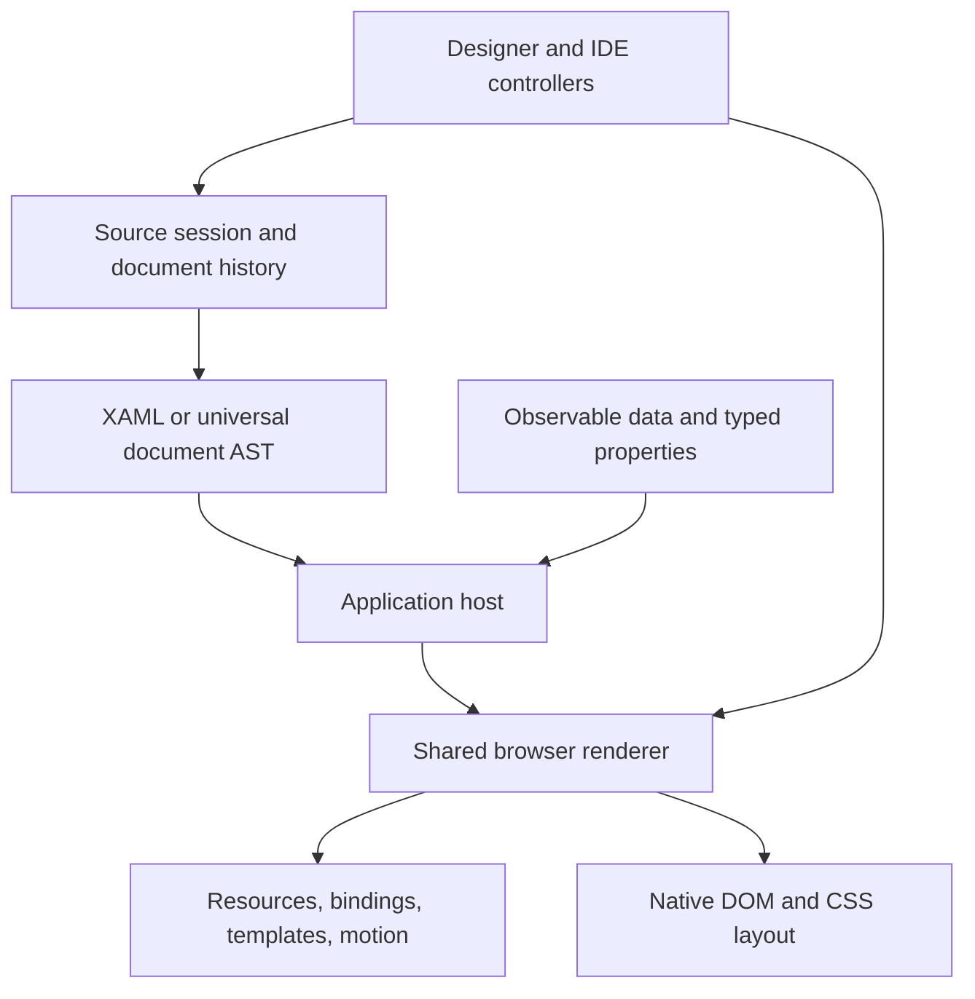

# Xamora web framework architecture

Xamora's browser application runtime and visual designer share their implementation. The canonical ES modules remain in `dist/core/` and `dist/controls/`, so the existing buildless designer keeps its imports. The package build copies these modules into explicit ownership boundaries, rewrites imports between boundaries to package subpaths, emits CommonJS and declarations, and produces standalone browser bundles. There is no second parser or fork of the preview renderer in an npm-only source tree.

## What the designer already supplied

The reusable foundation includes the universal document tree, strict XAML parsing and HTML projection, source ranges, reversible document edits, toolkit descriptors, resource/style/template lookup, binding expressions, data tables and queries, browser layout/rendering, property paths, animation clocks and visual-state sampling. These are useful runtime primitives but were previously assembled by studio controllers and prototype sessions.

Standalone applications also need an application lifetime, observed application data, typed property metadata, input write-back, registered event/command dispatch, predictable cleanup, runtime diagnostics, a stable public package surface and qualification outside the repository. The new runtime supplies that host layer. Editor history, docking, source editing and design annotations remain available as independent SDK packages.

## Dependency direction

The application host uses the browser's DOM and layout engine. Grid, flex, absolute positioning, native inputs and SVG represent supported XAML layout/control semantics. Framework-specific measure/arrange behavior is not inferred from names, and arbitrary .NET assemblies do not execute in this runtime. Custom controls register their browser renderer and metadata explicitly. Existing WPF/Avalonia source remains useful, with unsupported features diagnosed or handled by an application adapter.

## State and property flow

An application owns its document, renderer, observable data and property store. Data updates schedule rendering through the application lifetime. Binding expressions resolve against the shared data-context model, and supported two-way inputs write through the observable state. Registered converters can participate in both directions. Authored source is separate from runtime data and animation samples.

Runtime property metadata describes coercion, validation, defaults, inheritance and default binding mode. The property store records values by source precedence. Application overrides and sampled motion are applied to runtime rendering without rewriting the original XAML. Resource/theme updates use the existing resource and style lookup machinery.

Commands and handlers are host-provided functions. Markup selects registered names; it is not evaluated as JavaScript. Custom toolkit renderers are application code and therefore run with the application's normal browser privileges. Application disposal cancels scheduled work and releases subscriptions, plugins and rendered content. The custom-element adapter ties this lifetime to DOM connection/disconnection.

## Packages and build integrity

Each source module has one package owner. Cross-package imports refer to that owner's exported module, preserving identities such as `DocumentStore` and `ToolkitRegistry` when consumed through multiple entrypoints. The package graph is derived from real source imports, and unresolved dependencies fail the build. Package consumers do not reach back into the repository.

The build generates ESM, CommonJS, declarations and explicit exports. Browser bundles are convenience entrypoints for applications without a bundler; normal package imports retain modular boundaries. Styles and other required assets are included in each package's publish allowlist. Shared development tooling is locked at the private repository root.

Validation installs packed tarballs into an isolated consumer, checks import/require and shared identities, and type-checks consumer programs. Browser tests mount standalone applications as well as exercising the complete designer. This tests the shipped surface rather than treating successful source imports as proof of package correctness.

See [the package guide](PACKAGES.md) for package names, commands, release artifacts and npm setup. Publication is a separate manual operation: this implementation adds support and does not publish packages to npm.

## Extension points and practical limits

- `ToolkitRegistry` supplies control descriptors and browser renderers. Native controls need an adapter implementing their behavior in the browser.
- Runtime property metadata and converters extend typed values and data binding without changing the parser.
- Application lifecycle plugins compose integration and cleanup around a mounted document.
- Source sessions, the renderer and animation APIs remain independently usable by tooling.
- Browser layout and control behavior are authoritative for standalone apps. Native .NET layout, arbitrary code-behind, platform services and assembly loading require additional runtime integrations.
- Large-tree rendering and template materialization inherit the existing renderer's scaling limits. The package split does not claim virtualization or native framework compatibility that the renderer has not implemented.

See [the runtime API guide](WEB-RUNTIME.md), [existing compatibility notes](COMPATIBILITY.md), and the actual browser/consumer tests for the supported contract.
